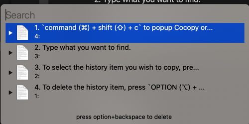

+++
title = "使用文档"
date= "2020-03-11"
tags= ["help"]
categories= ["help"]
+++

# 介绍 Cocopy

什么是cocopy 意思为： Cool Copy

目的是使剪切板的管理，简单、高效、强大

期亮点是，可以对剪切板上面内容进行操作，以及支持调用外部命令。

使用户可以使用强大的命令行工具组合使用


## 基础使用

1. `command (⌘) + shift (⇧) + c` to popup Cocopy or click on its icon in the menu bar.
2. Type what you want to find.
3. To select the history item you wish to copy, press ENTER, or click the item
4. To delete the history item, press `OPTION (⌥) + DELETE (⌫)`.



## 扩展


选择 Preference 调出偏好设置


**当前版本支持的类型为:**

| 类型 | 说明 |
|--------|--------|
|  string |  文本类型 |
| png |  图片类型(png,tiff,图片文件等)都转为png 格式输出      |
| fileUrl | 格式为 file:///path/path2/filename.png |
| filePath| 格式为 /path/path2/file.png |
| html | html 原文 |

**as 后面则是选择以什么方式传递给命令**

| 方式 | 说明 |
|--------|--------|
| stream       | 以流的形式输出,等价于 : `$ pbpaste | hello.sh`        |
| streamln       | 以流的形式输出,等价于 : `$ echo "$(pbpaste)" | hello.sh`        |
| variable | 以环境变量,等价于 : `$ query="$(pbpaste)" hello.sh`        |
| variable.query_string | 以环境变量,等价于 : `$ query="$(pbpaste | encodeURIComponent)" | hello.sh` |
| base64 | 以base64形式输出,等价于: `$ pbpaste | base64 | hello.sh` |
|type base64| 以[类型]()+空格+base64 形式输出,等价于:`$ echo $type "$(pbpaste | base64)" |hello.sh` |

**command: 为需要调用的命令,目前版本不支持直接在这里使用管道**

**out type: 输出到剪切板的类型**

| 类型| 备注 |
|--------|--------|
|  string | 输出文本类型       |
| tiff | 输出tiff       |
| png |  输出png 格式      |
| type base64 | 返回`类型 值的base64`       |
| empty |  无任何返回       |

## 命令功能

当开头为`:`时，直接执行后面命令，将标准输出复制到剪切板

比如输入 

```
:ps
```

然后选择列表提示项

## 自定义按键


## 扩展

### ocr

使用brew 安装 tesseract 及语言包

```
brew install tesseract tesseract-lang
```

拷贝以下命令

```
{"timeout": "5","name": "image/ocr-tesseract-chi_sim","command": "tesseract stdin stdout -l chi_sim","type": "png","outputType": "string","as": "stream"}
```

即可从图片提取文本,可结合 Snipaste 等截图工具，效果更佳