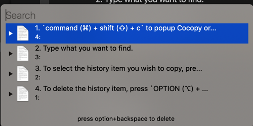
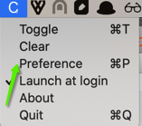
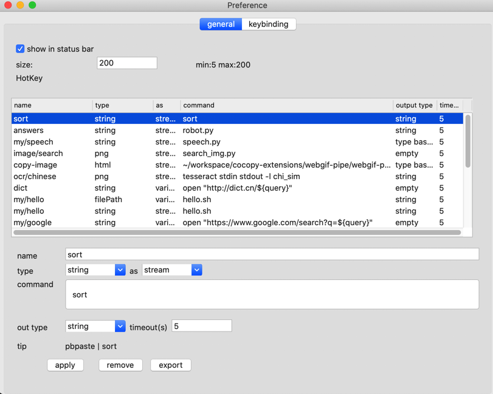
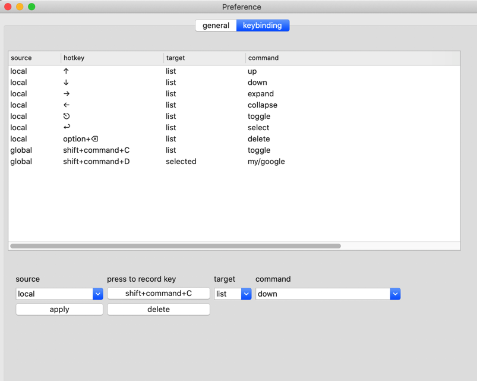

# Introduction to Cocopy

What does cocopy mean: Cool Copy

The purpose is to make the management of the clipboard simple, efficient and powerful

The highlight is that you can operate the contents on the clipboard and support calling external commands.

Enables users to use a combination of powerful command line tools


## Basic usage

1. `command (⌘) + shift (⇧) + c` to popup Cocopy or click on its icon in the menu bar.
2. Type what you want to find.
3. To select the history item you wish to copy, press ENTER, or click the item
4. To delete the history item, press `OPTION (⌥) + DELETE (⌫)`.



## Extension



Select Preference to bring up preferences



**The types supported by the current version are:**

| Type | Description |
| -------- | -------- |
| string | Text Type |
png | image types (png, tiff, image files, etc.) are converted to png format and output |
fileUrl | Format is file:///path/path2/filename.png |
| filePath | format is /path/path2/file.png |
| html | html original |

**as is the way to choose to pass to the command**

| Way | Explanation |
| -------- | -------- |
| stream | Output as stream, equivalent to: `$ pbpaste | hello.sh` |
streamln | Output as a stream, equivalent to: `$ echo" $ (pbpaste) "| hello.sh` |
variable | Environment variables, equivalent to: `$ query =" $ (pbpaste) "hello.sh` |
variable.query_string | Environment variables, equivalent to: `$ query =" $ (pbpaste | encodeURIComponent) "| hello.sh` |
base64 | Output as base64, equivalent to: `$ pbpaste | base64 | hello.sh` |
| type base64 | is output as [type] () + space + base64, which is equivalent to: `$ echo $ type" $ (pbpaste | base64) "| hello.sh` |

**command: For the command to be called, the current version does not support using pipes directly here**

**out type: The type of output to the clipboard**

| Type | Remarks |
| -------- | -------- |
| string | output text type |
| tiff | output tiff |
| png | output png format |
| type base64 | returns base64 of type
| empty | No return |

## Command Function

When it starts with `:`, execute the following command directly to copy the standard output to the clipboard

Such as input

```
:ps
```

Then select the list prompt item

## Custom keys

